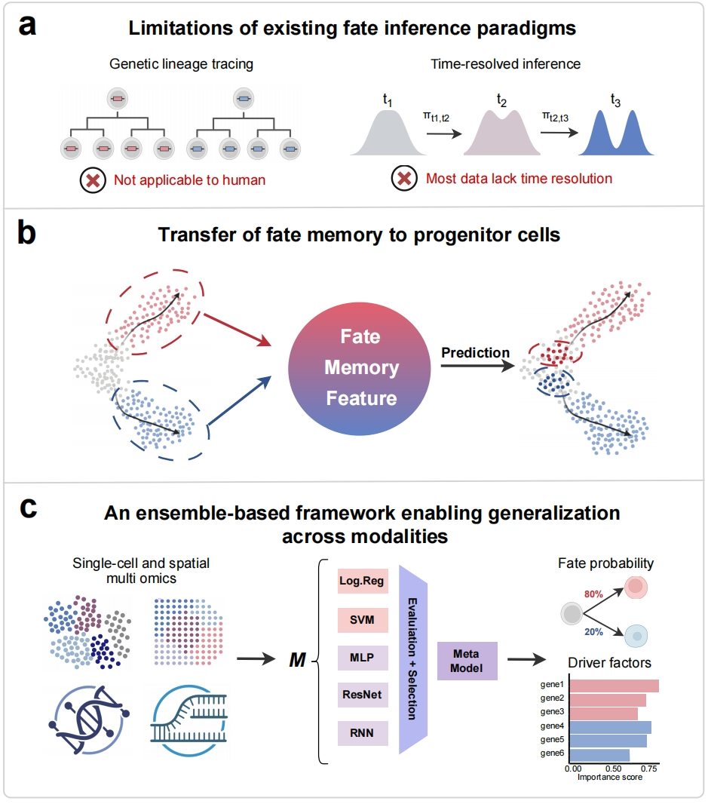

# Ageas

Ageas is a computational framework for inferring cell fate bias from static single-cell and spatial multi-omics data. Instead of relying on time-series measurements, pseudotime ordering, or experimental lineage tracing, Ageas learns fate-discriminative molecular features from annotated terminal cell populations and transfers this information to progenitor or intermediate cells.

> This project is under active development.

<p align="center">
  
</p>

## Key Features

- **Time-agnostic fate inference**  
  Infers fate bias from static molecular profiles without requiring time-resolved sampling, pseudotime trajectories, or genetic lineage labels.

- **Transfer learning from terminal states**  
  Learns fate-discriminative molecular features from annotated terminal populations and projects these features onto progenitor or intermediate cells.

- **Data-adaptive ensemble modeling**  
  Evaluates multiple model architectures and retains well-performing models to construct a robust ensemble for fate-bias prediction.

- **Multi-modal compatibility**  
  Supports single-cell RNA-seq, single-cell chromatin accessibility, inferred transcription factor activity, and spatial transcriptomic profiles.

- **Model interpretation**  
  Prioritizes genes, regulatory elements, or transcription factor activities associated with predicted fate bias using model-specific attribution strategies.

## Core implementation modules

- **Heterogeneous model panel.** Mixes deep-learning classifiers
  (`NN_Classifier`, `Mixer_Classifier`) with classical estimators
  (`XGB_Classifier`, `LogReg_Classifier`, `SVM_Classifier`,
  `MNB_Classifier`) under a single Lightning-style API.
- **N-iteration k-fold selection.** `n_kfold_selection` runs successive
  cross-validation rounds and prunes the squad to the units that survive
  the configured retention and cutoff thresholds.
- **Iterative factor extraction.** `n_iter_extraction` and
  `n_iter_boost_selection` chain selection and explanation passes to
  converge on the most informative regulatory factors per cell class.
- **Unified explanation pipeline.** `Deck.debrief` weights per-unit
  explanations by their validation/test metrics and produces a single
  integrated importance table across the squad.

## Requirements

- Python ≥ 3.11
- A CUDA-capable GPU is recommended for the neural-network classifiers
  and for SHAP-based explanation of XGBoost models. Classical classifiers
  run comfortably on CPU.

## Installation

From source:

```bash
gh repo clone MaftyLab/Ageas
cd Ageas
pip install .
```

This pulls in the core dependencies: PyTorch, PyTorch Lightning, XGBoost,
scikit-learn, imbalanced-learn, AnnData, SHAP, and Captum.

## Quickstart

The snippet below runs the full pipeline on synthetic data and prints the
top features per class. It should finish in under a minute on CPU.

```python
import ageas
from ageas import Hangar, n_kfold_selection
from ageas.tool import Multimodal_Corpus, make_fake_adata

# 1. Synthetic AnnData (2 classes, informative + noise genes)
adata = make_fake_adata(n_class=2, n_clusters_per_class=1)
adata.write_h5ad("ageas_tutorial_fake.h5ad")

# 2. Wrap it in the dataset object Ageas consumes
corpus = Multimodal_Corpus(
    "ageas_tutorial_fake.h5ad",
    label_key="celltype",
    backed=False,
)

# 3. Load a panel of candidate models
hangar = Hangar("data/configs/sample_panel")

# 4. K-fold selection — keep models above the retention threshold
deck = n_kfold_selection(
    hangar=hangar,
    query_dataset=corpus,
    test_dataset=corpus,
    kfold_selection_list=[2],
    monitor_metric="test.accuracy",
    retention_point=0.5,
    seed=42,
)

# 5. Predict and explain
preds, labels = deck.predict(query_dataset=corpus)
importance = deck.debrief(exp_dataset=corpus)
print(importance["Class_0_Scores"].sort_values(ascending=False).head(5))
```

A verified, end-to-end version of this workflow lives at
[docs/tutorials/01_quickstart.py](docs/tutorials/01_quickstart.py). Two
additional tutorials cover data preparation
([02_data_preparation.py](docs/tutorials/02_data_preparation.py)) and
advanced usage ([03_advanced_usage.py](docs/tutorials/03_advanced_usage.py)).

## Examples

- Apply Ageas on scRNA-seq data:
  [scripts/celltag-multi.ipynb](scripts/celltag-multi.ipynb)
- Apply Ageas on spatial transcriptomics data:
  [scripts/spatial_example.ipynb](scripts/spatial_example.ipynb)

## Model Config

Ageas is a selection- and evaluation-based framework. It requires an input
model config to define the candidate model panel and selection behavior. The
default config is available at
[data/configs/default_config_v1](data/configs/default_config_v1).

## Documentation

Full docs are hosted on [GitHub Pages](https://maftylab.github.io/Ageas/html/index.html)

- Installation: [docs/installation.rst](docs/installation.rst)
- Tutorials: [docs/tutorials/](docs/tutorials/)
- API reference: [docs/api.rst](docs/api.rst)

Build the HTML docs locally:

```bash
cd docs && make html
```

## Project Layout

```
ageas/
├── classical/   # XGBoost, LogReg, SVM, Naive Bayes, LinReg classifiers
├── nn/          # Neural-network classifiers and building blocks
├── ops/         # n_kfold_selection, n_iter_extraction, n_iter_boost_selection
├── tool/        # Corpus loaders, explainers, trainers, config helpers
├── deck.py      # Orchestrator for selection + ensemble prediction + debrief
├── hangar.py    # Panel of candidate Units loaded from JSON config folders
└── unit.py      # Wrapper around a single classifier configuration
```

## Citation

If you use Ageas in your research, please cite:

```bibtex
@software{ageas,
  title  = {Ageas enables time-agnostic cell fate inference from single-cell and spatial multi-omics data},
  author = {Junyao Jiang, Alex Kong, Jack Yu},
  url    = {https://github.com/MaftyLab/Ageas},
}
```

## License

Apache License 2.0 — see [LICENSE](LICENSE).

## Issues

Bug reports and feature requests: <https://github.com/MaftyLab/Ageas/issues>
